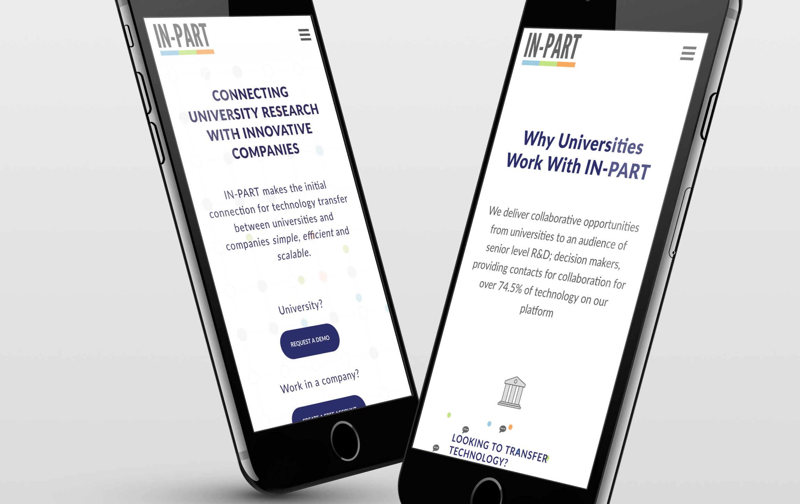

## Overview
IN-PART makes the initial connection for technology transfer between universities and companies simple, efficient and scalable.

The website they had was built at a time when the company was a small start-up and no longer matched their needs.

Users were not engaged and a lot of the content needed an overhaul.

The solution was to create a custom experience that showcased exactly what the company did in a user friendly way.

## The Challenge
The brief was to redesign the website to better meet their goal of sign ups and account creation.

## Research
We were given quantitative data from the existing website in the form of analytics to help find problems and this formed the main bulk of our research into problem discovery. I realized we didn’t understand users motivations for using the website and that more research was needed in order to understand the problem.

By observing users and interviewing them, we were able to see how users were behaving and learn why. We also used our data to create two different personas.
It was also during this research that we realised the two personas expected very different interactions from the website, they only wanted to access what was applicable to them. We were able to use these insights and apply them to our user journey by creating seperate sections for each of our personas.

<figure class="figure">
  
  <figcaption>First iteration of full user flow</figcaption>
</figure>

## Process
We then created company and user goals and worked out all the different touch points and mapped out a complete user flow for each of the goals. We used the data to guide our flow using previous user behaviour.

<section class="figure-container">

  <figure class="figure figure__double">
    
    <figcaption>Beginning the user journey with thumbs</figcaption>
  </figure>

  <figure class="figure figure__double">
    
    <figcaption>Mobile View of the website</figcaption>
  </figure>

</section>

We began with some thumbnails on paper and then used Balsamiq to further develop some Lo Fi wireframes.

InVision was used to create a working clickable prototype to better understand how everything slotted together and was used as a primary solution to gather feedback and begin testing.
