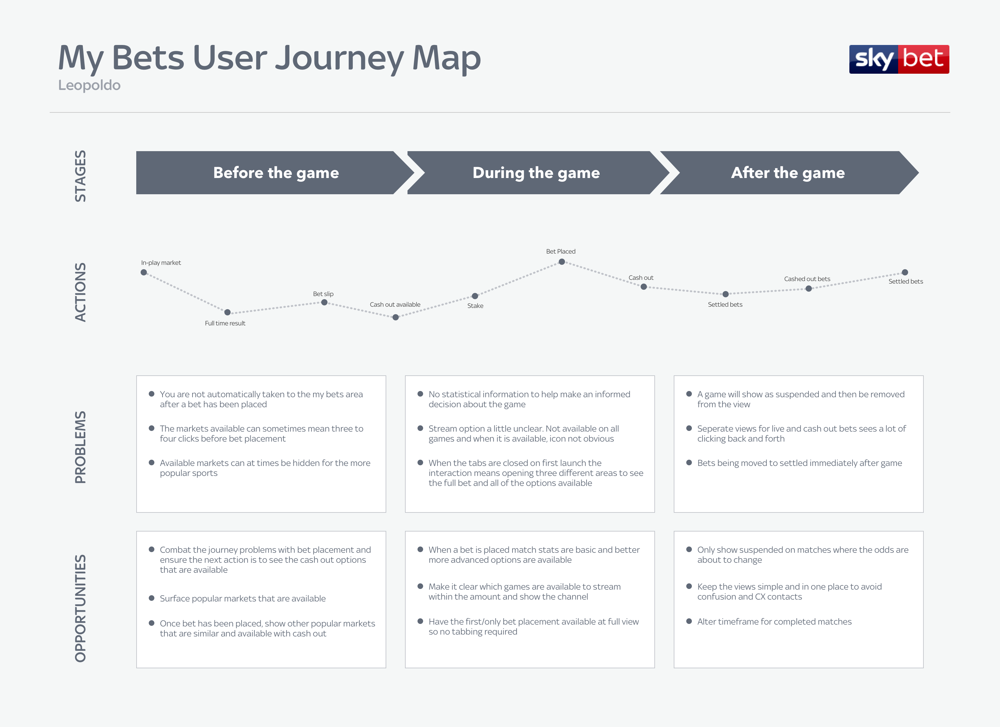
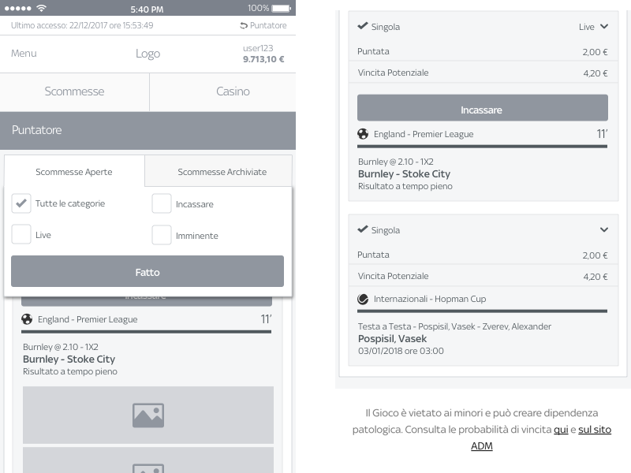
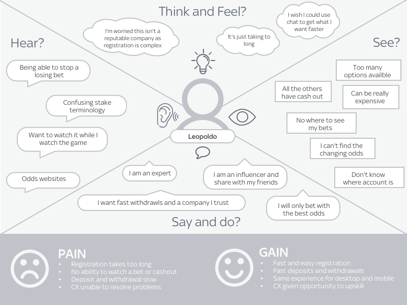

## Overview
Sky Bet Italia is a young product in the Italian market with a growing user base and were looking to launch Cash out to the Italian market. 
Cash out allows you to get money back on a bet before the event you are betting on is over. The amount of money you get back is determined at the time of cashing out and will depend upon the likelihood of the bet winning.

## The Challenge

Cash out was a new feature that the Italian market had never had before. We utilised the market research teams findings and found that whilst the Italian market didn't have access to Cash out their bets, consumers were aware of the feature from outside markets. There were many variations of Cash out features and many names for this.

We then conducted research to find out what consumers knew and how they saw this working.

## Research

Our formative research started with competitive analysis and stakeholder interviews before quickly moving onto user interviews. 

We realised that our research was telling us that users didn't just want the cash out feature, they wanted to check the position of their bet and see match stats in one place.
We knew from research that competitors didn't have anything like this but overseas markets did. 

We then conducted comparative user task analysis to understand the steps users expected to take when they cashed out.

We created an empathy map for each of our personas to capture user pain points and opportunities. 

Keeping track of bets and then cashing out was the route we explored in more detail.

<figure class="figure">
  
  <figcaption>Early journey map for one of the personas</figcaption>
</figure>

## Process

Based on user research, we created a series of user journey maps using our personas. These maps went through many iterations as we continued to conduct more research and refine our user flow.

We created and validated many low fidelity prototypes with users using success rate and efficiency to quantify our results.

Once we were happy with our usability results we moved onto hi fidelity prototyping and validated the designs further.

<section class="figure-container">

  <figure class="figure figure__double">
    
    <figcaption>Hi fidelity mobile wireframes</figcaption>
  </figure>

  <figure class="figure figure__double">
    
    <figcaption>Empathy map for one of the personas</figcaption>
  </figure>

</section>
