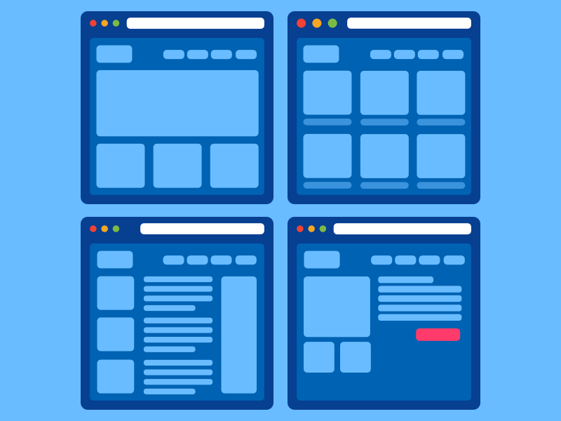

## Overview
Sprint Log aims to solve the issue of logging and monitoring running workouts for running clubs.

A contextual inquiry was carried out to understand the problem and learn how each runner would log their workout.

We learned some runners were logging what they had done on paper after their run or using online tools like Google Spreadsheets.

The trainers wanted a consistent way for their runners to log their style of run and diarise the event.

We ran a survey to gather more data based on what we learned in the contextual inquiry.
We asked questions about how they log their workouts currently and if they are told to do so by their personal trainer.
We also gathered personal information about them.

The solution was to create an app that would act as a workout diary where the runner could say what type of run it was, log the time, note their mindset and body condition and what the weather conditions were like. They could also upload a photo of their location if they chose to take their phone with them.

We also discovered that the runners wanted to be able to share their data with their trainers so the idea of an online dashboard was included.

## The Challenge
The brief was to solve the problem runners have with logging and diarising their runs so that they can reflect on their performance and improve future runs with or without a personal trainer.

## Research
We gathered all of the data gained from our contextual inquiry and survey research. We created insights to help us understand the problem and learn what people wanted.

Based on this research, we knew we needed to create an app that could also link to an online dashboard to log a runners workout. Everything on the app was also available online.

We then created a competitive analysis on competing apps to see if this problem had already been solved and realised that whilst the app stores are filled with diary and exercise based apps, the two are not usually seen as one solution.

We ran a small focus group with the aim of writing our user stories and creating our personas.

<figure class="figure">
  
  <figcaption>One of the developed personas</figcaption>
</figure>

## Process
Personas were finalised first and we mapped out the two persona’s journey based on our user stories.

We then began creating paper prototypes and testing these with our focus group.

Once we had gathered feedback we moved onto low fidelity wireframes and created a clickable prototype in InVision to test remotely.

<section class="figure-container">

  <figure class="figure figure__double">
    
    <figcaption>Low fidelity mobile wireframes</figcaption>
  </figure>

  <figure class="figure figure__double">
    
    <figcaption>Low fidelity desktop wireframes</figcaption>
  </figure>

</section>

Once we were happy with the results of the prototype, we moved onto the UI and worked up the app and screen designs in Sketch.
