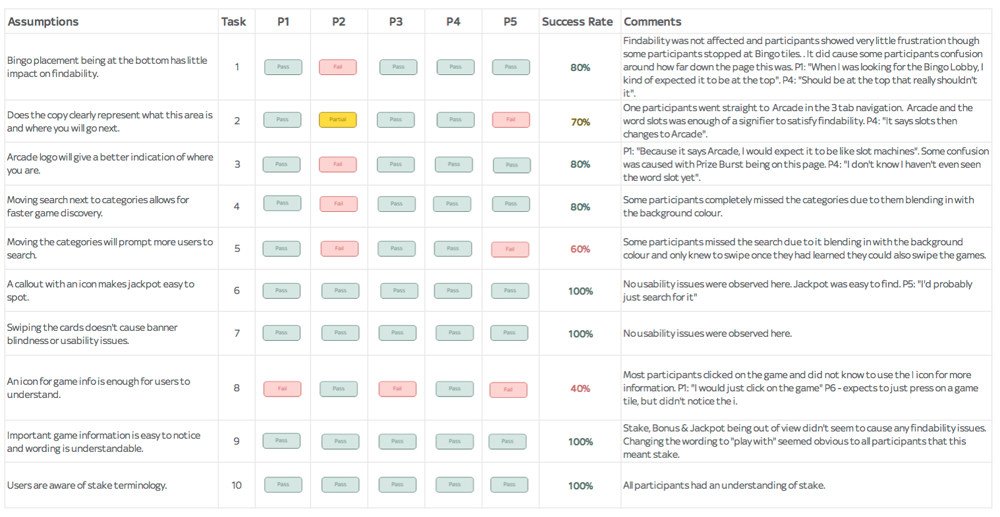
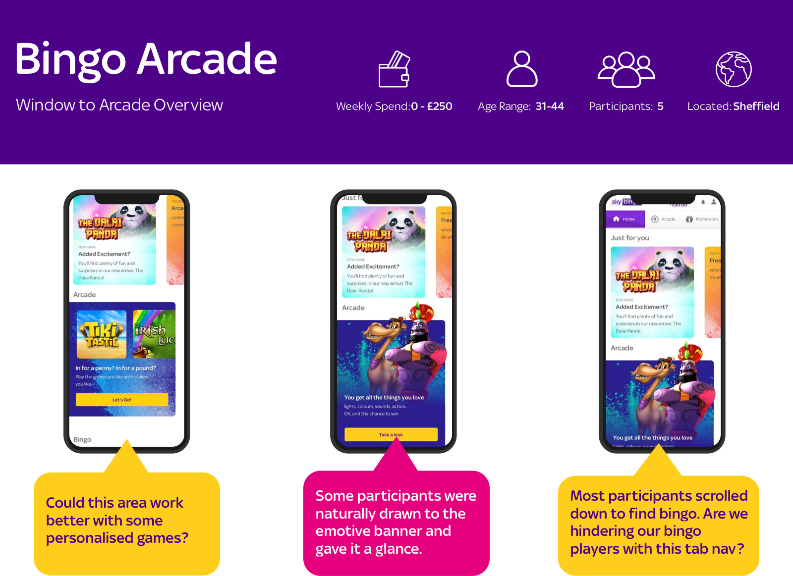
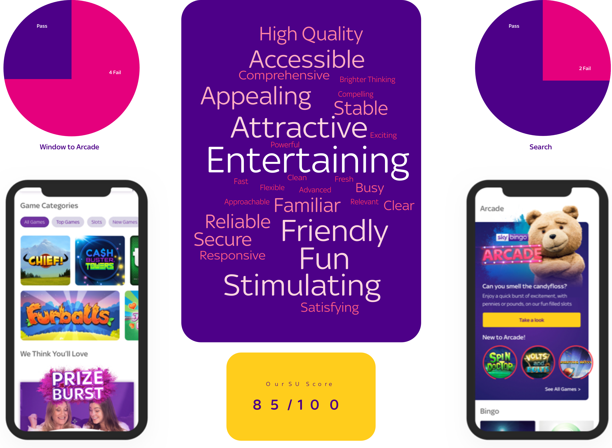

## Overview

Sky Bingo wanted to rebrand their slot offering and improve the user experience. The market research team had highlighted an opportunity in this area so a design sprint was formed to explore this in further detail.

## The Challenge

Our bingo players are generally casual players and only see the slot offering as side games for when they are waiting for a new bingo room. We wanted to position the slot games as an area in it's own right and the branding team worked on a brand that suggested slots but also had the gaming feel to it.

## Research

Our research started with user interviews to confirm how our players currently think and feel about our slot games. It was discovered that they saw slot and scratch card games as quicker to play but our offering and position wasn't exciting. They didn't want to spend a long time looking for games due to how and when they play.

We used this research to create an offering that was better suited to their time constraints and matched their needs.

A lot of our research activities from this point were in the form of validation so we conducted monthly lab sessions and carried out remote testing for benchmark tests.

<figure class="figure">
  
  <figcaption>One of the many User Testing analysis sheets</figcaption>
</figure>

## Next Steps

Based on our validation lab sessions, we created reports to steer the direction of the design and quickly iterate to hit a tight deadline. We worked within an agile team so had to leverage remote testing on top of monthly lab sessions so that we could learn quickly and move fast.

We moved away from Axure and used UX Pin for the majority of our prototypes as this software was much better for teams who were moving at speed.

For the final two labs, we concentrated on usability and our user flow. With fantastic results we then moved onto stakeholder sign off.

<section class="figure-container">

  <figure class="figure figure__double">
    
    <figcaption>Snippet of the report from user testing</figcaption>
  </figure>

  <figure class="figure figure__double">
    
    <figcaption>Snippet of the data from user testing</figcaption>
  </figure>

</section>

## Results & Highlights

I presented the user lab interviews at Sky Betting & Gamings ahead of the game customer takeover day to highlight the importance of lab testing for this project.

Sky Bingo saw game launches increasing by 22% in its first few weeks and hit a huge milestone in stakes in under a month of being launched.
