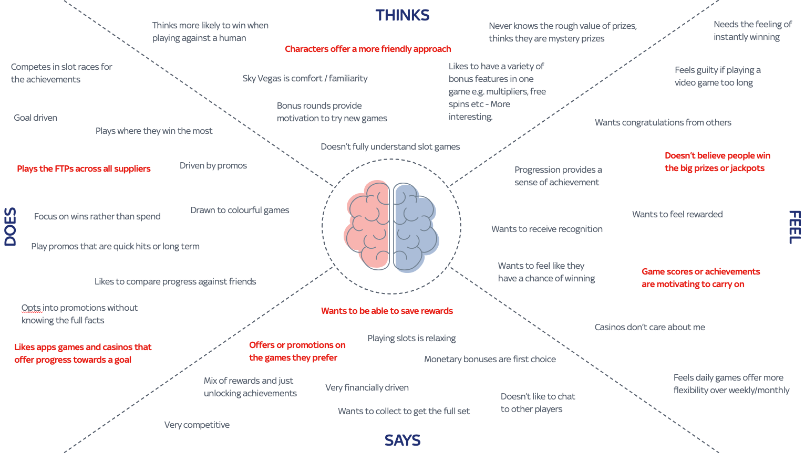
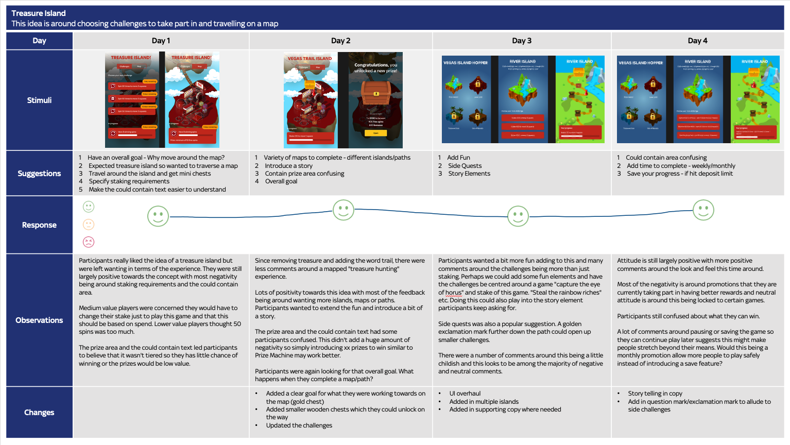

## Overview

Following multiple forms of customer engagement during a promotion discovery process, there was a clear interest in delivering a feature where users are rewarded with a token for carrying out certain actions. These tokens can eventually be redeemed against a prize.

### The Challenge

Our hypothesis based on past research was around delivering a compellingly different promotion experience that would increase in week on week retention and we would know we’ve been successful when we see a 3% increase in week on week retention as a result of running this new promotion.

### Research

The new promotion mechanics discovery process took us on a journey of uncovering user needs and testing our ideas and including users every step of the way so that we could say with confidence what our customers want from promotions.

The activities we utilised included:
* 14 in-depth interviews with users
* 2 day Participatory design workshops with 10 users
* Stack Ranking at scale with 1428 users
* Ideation
* Week long Iterative Concept Testing with 816 users

#### Interviews

We ran in-depth 1-on-1 interviews talking to participants and asking them questions about their behaviors, beliefs, and habits around promotions looking to uncover their unmet needs.

We heard about their current promotional requirements and what promotions they have played and what they are playing now. We didn’t just stick with gambling related promotions. We were interested in other forms too.

We then themed what we had learned and connected it back to our assumption around collectables.

Knowing we were on the right path with strong themes around collectables and needs for promotions, we moved onto participatory design.

<blockquote>"That search for the phoenix promotion where you come back everyday and see what you've got and where you can go next is really good. I enjoy that one and always go back every morning. It's become a routine for me to see what i've got and where i'm at. You don't get much but it builds up" - User 4 from interviews</blockquote>

#### Participatory Design

Participatory design lends itself to user-centred design innovation by bringing your users into the same room with designers, stakeholders and researchers to design and brainstorm ideas together. 

We asked users to help us design their perfect promotion and encouraged them to think big whilst recalling some of their favourite past and present promotions.

The results from all sessions had some similarities in what they wanted and needed though all looked quite different. 

We then brought together what we had learned to build an empathy map.

<figure class="figure">
  
  <figcaption>Empathy map created from participatory design</figcaption>
</figure>

#### Stack Ranking

Customer problem stack ranking tells you how important an concept is compared to the other problems the target customers experience. It's a simple data-driven approach to understand whether an concept solves a burning pain point or just a mild inconvenience.

Based on what we had learned during the interviews and participatory design, we built up a problem statement and gathered together other problem statements.

We did this at scale to validate the need and learnings from the stack ranking validated the basic concept of this new promotion we were looking to create.

#### Ideation

Product, Product Design and key stakeholders then worked together to workshop some ideas around what we had learned so far and created several strong ideas.
These concepts were then brought to life visually very quickly in order to get them in front of users for feedback.

#### Iterative Concept Testing

We then put our early-stage ideas in front of users to determine which direction the team should go in or whether or not we were going in the right direction. Our aim was to test risky concepts early and iteratively.

We were looking for: 
* Desirability – Uncover emotive responses and how desirable they find it
* Acceptance – Evaluate acceptance towards the concept and gather feedback

<blockquote>"Test risky concepts early and iteratively"</blockquote>

We ran iterative concept testing over the course of a week and following the below process:
1. Step 1 - Ideas are ready to send out
2. Step 2 - The data is analysed in the morning and fed back to the team
3. Step 3 - Idea development begins in the afternoon based on the feedback ready to send out to users at the end of the day
Continue steps 2-3 until day 5 or until you have exhausted feedback

<figure class="figure">
  
  <figcaption>Iterative concept testing results for one of the ideas</figcaption>
</figure>

We were able to see how the concept progressed based on feedback throughout the week. We gathered various forms of data to tell us how the idea was doing and what needed to change. 

### Results & Highlights

One of the ideas performed well and went into development and was remarked as being strong at driving ARPU and net margin from existing customers, one of the highest volume promotions ever run, drove prompted awareness and consideration of the product and users who were predicted to churn during the campaign period were retained by engaging with this new promotion.

Innovation on this project also saw UXR grow in influence within the company.

The strategic impact was also a success and a directional impact has led to decision making around promotions which will have a longer shelf life than just the one promotion that has been built.
