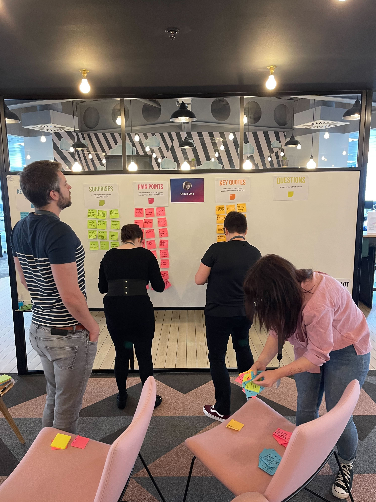
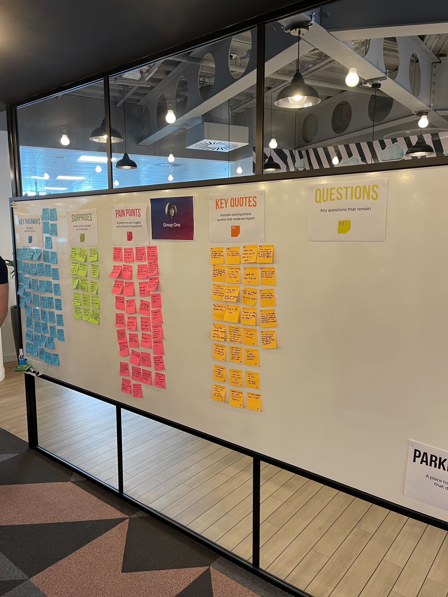
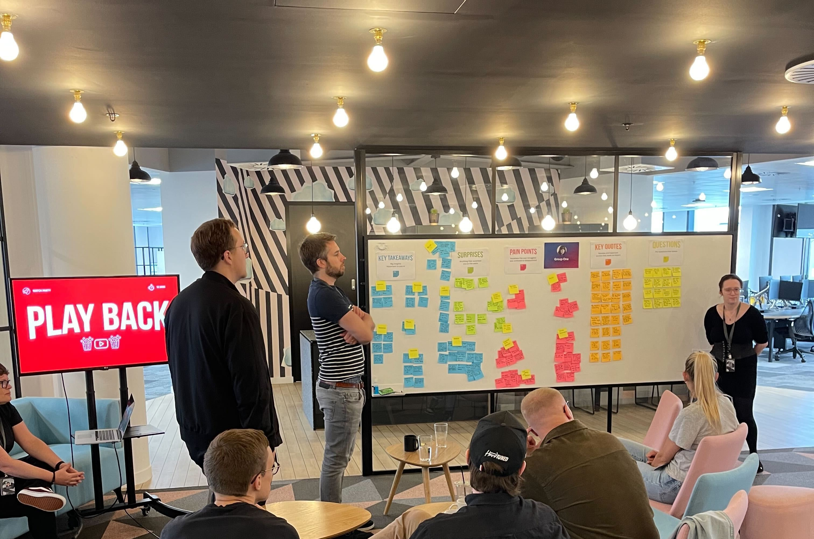

## Overview

UX, CX, usability, user testing. No matter what you call it, putting customers at the centre of company culture has become a competitive advantage that not only attracts new customers but keeps them coming back. Because of this, customers will be expecting better and better experiences in the future.

The watchparty was introduced to bring people across the company closer to our customers.

The purpose of the Watchparty is to playback recent testing or research with customers using our products, workshop and synthesise the findings and get us closer to our users wants and needs.

## The Challenge

UX Research at its core is the practice of studying user interactions to help with the design of people-first products and experiences but everyone is busy, and reports are long.

What better way to build a user centred culture than to observe our customers and synthesise what we learn.

For two hours, we turned product designers and product managers into UX Researchers, and they took part in observation and synthesis.

<section class="figure-container">

<figure class="figure figure__double">
    
    <figcaption>Group one debrief break out</figcaption>
  </figure>

  <figure class="figure figure__double">
    
    <figcaption>Group ones board ready for synthesis</figcaption>
  </figure>

</section>

## Process

For the first watchparty we used usability benchmark videos for one of our products as it showcased many journeys and interactions. 

The agenda for the workshop:
* Get settled in
* Intro to the watch party
* Grab the popcorn and watch some videos
* Break
* Debrief in groups
* Synthesis in groups
* Playback
* Outro

<figure class="figure">
	
    <figcaption>Playback of group ones findings</figcaption>
</figure>

## Results & Highlights

Some fantastic discussions meant that we used the analysis to help with our reporting for the project and plenty of interest to run these sessions more often and with wider teams.
