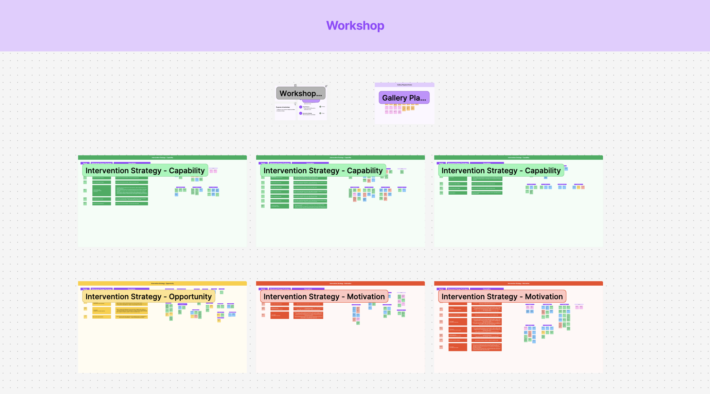
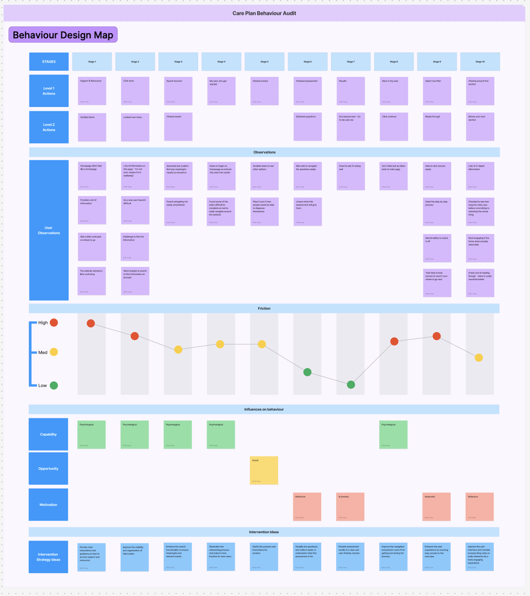

As a Lead UX Researcher, you have been asked to provide feedback and make chanegs to a colleagues case study. Keeping the structure intact, edit the below case study to be more robust and detailed.

## 1) Executive Summary

We identified that drop-off was less about “lack of interest” and more about *uncertainty, overload, and low perceived value* in the early flow. We translated qualitative + behavioural-science diagnosis into a focused set of product bets: clearer orientation, better search/findability, and lightweight “investment loops” (tracking, quick activities) to drive repeat use. 

**My role:** Lead UX Researcher and strategic partner. Led the problem framing, created a mixed evidence base (analytics + survey + interviews), and operationalised findings into a COM-B/TDF diagnosis and intervention directions.

**Team / collaborators:** Cross-functional partnership with Product, Design, and Clinical stakeholders.

## 2) The Challenge & Context

**Problem space:** Engagement was collapsing at the exact moment users were asked to choose a “care issue” and commit to a Mental Health Care Plan (Such as depression and anxiety). Nearly half of users started onboarding but dropped off before selecting a care issue, and only 10% completed onboarding and opened a care plan.

**Why it mattered now:** The business lacked confident evidence on what Care Plans should contain, how structured they should be, and what topics were worth prioritising. Without this, roadmap prioritisation and content investment were effectively guesswork, which put ROI/VOI at risk. 

**Research goals:**

- Understand *why* users drop off and what they expect from Care Plans (not just what they click).
- Determine user preferences for structured versus unstructured digital support, and where therapist involvement fits.
- Identify the top behavioural barriers and translate them into clear product direction.

**Constraints:**

- Strong need to make decisions with partial data and move from “numbers with no context” to decision-grade insight.
- A complex space where users often have multiple issues at once (81% present with more than one; 56% have 2–3 issues), which makes a simple “pick one care issue” model brittle.

## 3) Strategic Approach & Methodology

**Method selection:**

- **Behavioural analytics** to quantify where the funnel breaks and the size of the opportunity (drop-off and completion rates).
- **Survey quant + qual** to understand demand, preferences (structured vs flexible), and the role of therapist support at scale.
- **Primary interviews** to get the “why” behind behaviours and uncover mental models like “I don’t know what to pick” and “I want something actionable.”
- **Behavioural-science synthesis (COM-B + TDF + BCW intervention functions)** to turn a long list of findings into a prioritised, designable set of behavioural problems and intervention directions.

**Participant strategy:**  

- Survey target was employed adults in Canada/USA with a representative sample (proposal aimed for N=500) to support roadmap-level decisions, not just UX tweaks.

**Lead-level “multiplier” move:**  

- Instead of stopping at themes, we built a reusable diagnosis structure (COM-B/TDF mapping + intervention functions) that product and design can apply beyond one feature.

## 4) The “Messy Middle”

**Stakeholder alignment under ambiguity:**  

Stakeholders explicitly called out that the team had “numbers but no context” and needed to avoid guessing (for example, “people only want therapy” versus “care plans lack interactivity”). The research reframed the conversation from opinions to testable behavioural barriers and evidence-backed product levers.

**The pivot:**  

While “interactive tools” were an early hypothesis, the evidence broadened the problem: users were getting overwhelmed, struggling to find the right entry point, and not seeing a clear path after assessments.

**Synthesis without a sticky-note photo dump:**  

I created an interview theme table and translated a large barrier set into COM-B/TDF domains, then connected each to intervention functions. That is the bridge from insight to roadmap.

## 5) Insights & Actionable Recommendations

1) **“Care issue selection” is a high-friction commitment point, not a simple choice.**  

Evidence: 23.1% are not sure what care issue to select, and 47% drop before selecting one.

Recommendation direction: reduce cognitive load and uncertainty with guided selection, plain-language framing, and better orientation to what a care issue is and what happens next.

2) **Users often have multiple issues, but the product forces a single-threaded mental model.**  

Evidence: 81% present with more than one issue; 56% have 2–3 issues.

Recommendation direction: support multi-topic pathways, allow “I’m not sure” entry points, and enable personalisation that does not require self-diagnosis.

3) **Value is tied to “actionability” and progress, not just content volume.**  

Evidence: interview themes emphasise progression/tracking and short activities that fit life; workshop ideas repeatedly call for goals, check-ins, and visible progress without guilt.

Recommendation direction: introduce lightweight “investment loops” (trackers, quick wins, micro-commitments) and clearer progress/history views.

4) **Therapy and self-guided tools work best as a system, not separate lanes.**  

Evidence: interviews stress combining therapy and resources, and stakeholder notes highlight the need to connect the front end to providers so providers can reinforce Care Plan usage. 

Recommendation direction: provider-facing visibility into care plan progress, and user-facing guidance that explains how self-guided work supports therapy.

<figure class="figure">
	
    <figcaption>Figjam view of the workshop</figcaption>
</figure>

<figure class="figure">
	
    <figcaption>High level view of the behaviour design map deliverable from the full care plan behaviour audit</figcaption>
</figure>

## 6) Business Impact & Outcomes

**Product/roadmap influence:**

- Converted “we’re guessing” into a structured, prioritised set of behavioural barriers and intervention functions, giving the team a roadmap-ready decision framework.
- Identified which changes are likely to move the metrics (clarity and guidance at the decision point, findability/search, progress loops), rather than broad “redesign everything” feedback.

**Reflections:**

The organisation had funnel metrics but lacked explanatory insight and an operationalised research-to-roadmap mechanism. This project increased research maturity by creating a repeatable behavioural diagnosis approach and aligning qualitative evidence with measurable drop-off points.
