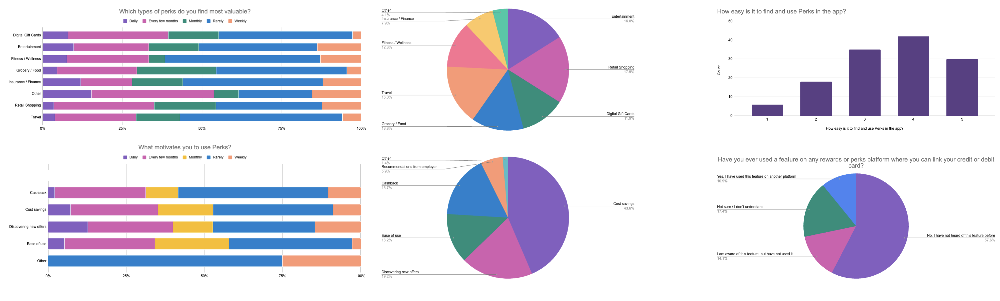

## 1) Executive Summary

We identified that the Perks area was **under-leveraged not because people dislike saving money**, but because **relevance + trust + findability** broke down. The work produced a prioritised set of **quick wins** (notifications, redemption clarity, gift card expansion, clearer terms) and **big bets** (localisation, personalisation, deeper in-app integration) to drive repeat use.

**My role** Lead UX Researcher (research strategy, survey design, analysis, and executive storytelling).

**Team / partners** Collaborated with cross-functional partners from sales and product.

## 2) The Challenge & Context

### The problem space

TELUS Health One’s Perks area contained a large catalogue (2,000+ offers), but signals suggested **inconsistent awareness and uneven engagement**. Senior stakeholders needed evidence on:

- What Perks categories people actually value.
- What drives usage.
- Where friction and distrust appear.
- What investments would most likely grow engagement and perceived value.

### Research goals

We focused on six gaps:

1. Category value (what’s worth investing in).
2. Motivations (why people show up).
3. Discovery and awareness (how Perks gets found, and what’s invisible).
4. Perks within the broader product (cross-feature synergy).
5. Friction points (redemption, offer clarity, technical issues).
6. Adoption levers (what would make usage more frequent).

## 3) Strategic Approach & Methodology

### Why this method

We chose an **in-product survey intercept** because the business needed **speed + scale** to validate where to invest (catalogue vs. UX vs. comms) and to quantify whether reported issues were isolated complaints or repeated patterns across segments.

### Participant strategy

- Surveyed members directly in-product across **English-speaking countries**.
- Analysis was conducted on **318 active members**.

## 4) The “Messy Middle”

### Stakeholder alignment

The work started from stakeholder questions (what categories matter, what drives engagement, how people discover Perks, and whether card-linking would land). I translated those questions into a survey structure that balanced:

- **Segmentation** (frequency of Perks use),
- **Value** (category preferences),
- **Experience** (findability, frustrations),
- **Opportunity** (what would increase use).

### The pivot: “It’s easy to find” vs “people forget it exists”

A key tension emerged in results:

- Many respondents rated Perks as **easy to find/use** (scores clustered at 4–5).
- Yet open text and other questions repeatedly surfaced **forgetting, irrelevance, and friction** (“can’t find anything,” “hard to use,” “forget it exists”).

This is a classic “average UX score hides segment pain” problem. The narrative pivot became: **the issue is not only navigation**. It is *habit formation* driven by relevance, trust, and competitive value.

### Synthesis approach

I synthesised along an actionable journey:

**Awareness - Discovery - Redemption - Trust - Repeat use**  

This allowed recommendations to map directly to owner teams and roadmap horizons (quick wins vs. major projects).

## 5) Insights & Actionable Recommendations

### Finding 1: Value is concentrated in discretionary spend, with clear expansion signals

Most valued categories were **Travel (37), Retail Shopping (35), Entertainment (34), Digital Gift Cards (31)** (with Grocery/Food also notable). Comments pushed toward **electronics, telco, premium brands, and in-person/local options**. This implies catalogue strategy should prioritise *high-salience categories* plus *local relevance*, not just “more offers.”

**Recommendation bridge:**  

Invest in **localised and more relevant offers** plus better browse/filter mechanisms (including “region” needs), and expand gift cards where they represent true utility.

### Finding 2: Motivation is almost purely transactional, so weak value = weak retention

The top motivator was **cost savings** (dominant across frequency bands), followed by **discovering new offers** and **cashback**. Employer recommendation was relatively minor. Some users reported having “no motivation,” implying Perks does not create a strong habit loop on its own.

**Recommendation bridge:**  

Make the value concrete and repeatable through:

- better “exclusive” positioning (avoid deals that are easily found elsewhere),
- targeted reminders,
- clearer redemption and faster cashback confidence-building.

### Finding 3: Feature awareness is a growth bottleneck

About **one third** reported being **unaware of additional features** (filters, notifications, digital wallet). This is a major adoption lever because it is typically **cheaper to fix than catalogue expansion**, and it multiplies the value of existing capability.

**Recommendation bridge:**  

Add lightweight **onboarding cues**, progressive disclosure, and contextual nudges to expose filters, wallet, and redemption steps at the moment they matter.

### Finding 4: Trust + redemption clarity are as important as discovery

Only ~25% reported no issues. Common issues included **finding offers**, **understanding redemption**, **clarity on offer terms**, **offer availability**, and **technical issues**. Qual comments point to trust erosion: “misleading,” “always a catch,” “cashback tracking takes too long,” and cases where Perks pricing was worse than direct booking.

**Recommendation bridge:**  

Prioritise:

- **clearer terms and transparency**,
- **redemption simplification**,
- **cashback tracking clarity and timeliness**,

because these reduce “try once and churn” behaviour.

<figure class="figure">
	
    <figcaption>A snapshot of some of the data</figcaption>
</figure>

## 6) Business Impact & Outcomes

### Product influence

This research produced a prioritised roadmap framing with an **Impact–Effort matrix**, aligning teams on what to do now vs. later:

- **Quick wins:** enhanced notifications, improved redemption, more gift card options, clearer offer info.
- **Big bets:** personalisation, more relevant/local offers, navigation overhaul, tighter integration with other TH1 features.
- **Major projects:** stackable/competitive offers, deeper integration work.

### Reflection
The survey showed how **topline usability ratings can mask behavioural reality**. When people say something is “easy,” they can still *not use it* due to relevance gaps, low trust, or lack of reminders. This reframed the org’s understanding from “fix navigation” to “build a value loop.”
