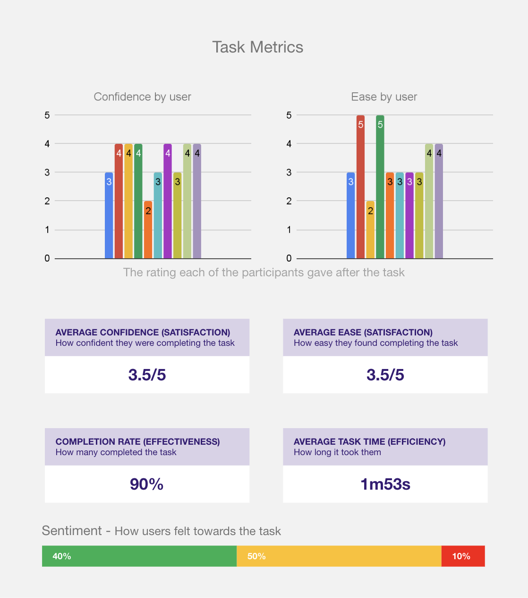

## 1) Executive Summary

- **Project title:** *Org Experience Tableau MVP Usability Validation: Making HR leader reporting truly self-serve*.
- **The punchline:** Usability testing showed the MVP’s **data is perceived as valuable**, but **navigation and filter affordances create “disaster” patterns** (people feel confident while being wrong) that could lead to **misreporting and poor decisions** unless addressed before wider rollout.
- **Your role:** Lead UX Researcher (end-to-end study design, execution oversight, synthesis, and recommendation framing).
- **Team:** Research (Emily). Design & prototype (Sirena, Carol).

## 2) The Challenge & Context

- **Problem space:** HR leaders need to **self-serve organisational performance insights** in the Strategy Portal with minimal support, and be able to **interpret metrics and benchmark comparisons** confidently.
- **What was at risk:** If users cannot reliably navigate, benchmark, and filter, they may:
    - Default to the **Home** view and assume it is “good enough.”
    - Make **benchmarking or service utilisation conclusions from the wrong slice**.
    - Export reports without knowing what exactly was exported (filters, date range, format).
- **Constraints (from available materials):**
    - **Remote, prototype-based validation** of a Tableau MVP (limits fidelity of interactions and “clickability” of controls, which may inflate confusion around filters).
    - **Broad, global participant mix** (10 participants) which is good for directional risk-finding but limits deeper segmentation analysis.

## 3) Strategic Approach & Methodology

- **Method selection (strategic rationale):**
    - Used **task-based usability testing** + **UMUX-Lite** to get both:
        - *Behavioural truth* (can they complete critical reporting tasks).
        - *Perception signal* (do they believe it is useful and easy enough to adopt).
    - This pairing is appropriate for an MVP because it quickly identifies **release-blocking breakdowns** and **adoption risk**.
- **Participant strategy:**
    - 10 participants aligned to target: **decision-making HR leaders in large organisations**, across key regions.
- **What makes this “Lead level”:**
    - You did not stop at “users struggled with filters.”
    - You framed failure modes as **decision and reporting risk**, including **disaster scenarios** (high confidence + low success), which is the right lens for analytics products used for executive conversations.

## 4) The “Messy Middle”

Use this as your collaboration storyline (grounded in the behaviors you observed):

- **Stakeholder alignment:** Positioned the study around protecting the business from *silent failure*:
    - “If HR leaders are wrong but confident, the portal becomes a reputational risk: bad insights travel upward faster than ‘I got stuck.’”
- **The pivot (what you learned that changed the framing):**
    - The core issue was not just UI polish.
    - The core issue was **users’ mental model mismatch**:
        - They look for benchmarking as a **dedicated ‘Compare/Benchmark’ control**, not something embedded in EAP summary content.
        - They repeatedly miss the **left sub-navigation**, and over-index on **Home** and **global filters**.
- **Synthesis approach (show, don’t photo-dump):**
    - You triangulated:
        - **Completion + time-on-task**
        - **Confidence/ease ratings**
        - **Click paths / navigation traces**
        - **Verbatims**
    - Then identified “disaster quadrants” (low success, mid/high confidence) as *priority risks*.

## 5) Insights & Actionable Recommendations

Here are four lead-level insights you can present (each bridges directly to action):

1) **Analytics “truth” is gated by navigation discoverability, not data quality.**  

- Evidence: repeated “left sub-menu missed” behaviors, wandering, staying on home, overuse of global filters (Tasks 2–4).
- Recommendation: strengthen left nav prominence + persistent visibility + strong active state + first-visit coach marks.

2) **Benchmarking is a mental-model problem: users expect an explicit comparison mode.**  

- Evidence: Task 2 completion 50% with moderate confidence; some believed Home was sufficient, a classic disaster risk.
- Recommendation: make “Benchmark/Compare” a clearly labeled, dedicated control and/or entry point, not “buried” inside EAP summary structure.

3) **Filters and date scoping create “silent misconfiguration” risk.**  

- Evidence: Tasks involving finding specific slices/time periods show low completion (Task 3: 10%; Task 4: 40%) while confidence stays mid-range, indicating users may report on the wrong slice without realizing it.
- Recommendation: clearer date range picker + presets + always-visible “active filters/date range” state and distinctions between global vs chart-level filters.

4) **Interpretation support is required: users can “find” metrics without understanding implications.**  

- Evidence: Task 1 high completion (90%) but only moderate confidence/ease (3.5/5), plus explicit requests for explanations/tooltips and “how to read this” context.
- Recommendation: inline metric definitions, tooltips, “how to read this” modules, and example interpretations to reduce misinterpretation risk.

<figure class="figure">
    
    <figcaption>data</figcaption>
</figure>

## 6) Business Impact & Outcomes

- **Prevented high-risk misreporting:** Identified “disaster” tasks (especially filter-driven analysis) where HR leaders may believe they have the right answer while using the wrong slice, creating downstream reporting risk.
- **Focused the roadmap on the highest leverage fixes:** Prioritised navigation and filter clarity as release-critical, not cosmetic polish.
- **Established usability baselines for iterative measurement:** Task success/time + UMUX-Lite provide a baseline to re-test after fixes.
